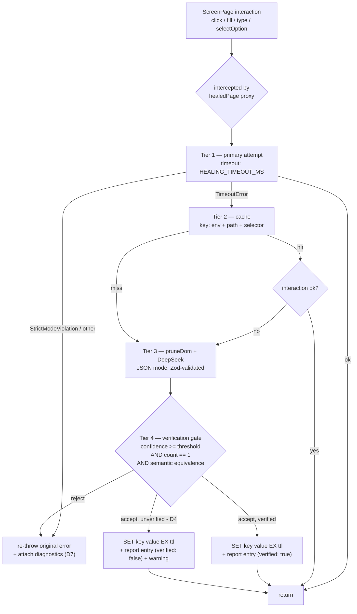

# Self-Healing Locators — Design

**Status:** implemented (Phases 0-5)
**Decisions locked:** 2026-09-19
**Supersedes:** the "4-tier" description in `README.md` (that text described the pre-fix code)

> Implementation notes that deviate from or refine this doc are marked **`[IMPLEMENTED]`** inline.
> Where the code could not follow a decision literally, the deviation is recorded — never silent.

---

## 1. Purpose

When a locator in `src/screen` no longer resolves, heal the run without hiding the
regression, and produce a reviewable fix for the ScreenPage.

The governing principle, from `CLAUDE.md` rule 3: **heal at the layer that broke.**
A healed run is a _symptom_; the fix is a one-line ScreenPage change that a human reviews.

---

## 2. What the healer actually knows

The LLM has no access to intent. It receives exactly two things:

| Input                      | Source                                   | Example                                                                          |
| -------------------------- | ---------------------------------------- | -------------------------------------------------------------------------------- |
| Failed selector **string** | Playwright's private `locator._selector` | `internal:role=button[name="Log In"i]`                                           |
| Pruned live DOM            | `pruneDom(page)`                         | interactive elements + `id`/`class`/`name`/`aria-label`/`data-*` + ≤30-char text |

`getBy*` locators serialise to _semantic_ engine strings, which is what makes repair
tractable:

```
getByRole('button', { name: 'Log In' })  ->  internal:role=button[name="Log In"i]
getByPlaceholder('User Name')            ->  internal:attr=[placeholder="User Name"i]
getByTestId('login-form')                ->  internal:testid=[data-testid="login-form"s]
getByLabel('Username')                   ->  internal:label="Username"i
locator('#gen-4821')                     ->  #gen-4821
```

The last line is the failure mode this design must handle explicitly: a raw CSS
selector carries **no semantics to verify against**.

---

## 3. Verified gaps in the current implementation

Read from source, not from the README.

### P0 — healing cannot trigger from any ScreenPage (blocker)

`ScreenPage.fill()` / `click()` (`src/core/screen-page.ts`) call
`await locator.waitFor({ state: 'visible' })` _before_ the intercepted method.
`waitFor` is not in `SELF_HEALING.interactiveMethods`, so the proxy binds it to the
**real** locator and it throws a `TimeoutError` first.

Net effect: no interaction that goes through `screens` or `flows` ever reaches Tier 2–4.
Combined with the fact that no spec imports `selfHealingFixture`, **the healing pipeline
is currently unreachable dead code.**

### P1 — nothing verifies the heal is the right element

Tier 4 (`selfHealingFixture.ts`) gates on `confidence >= 0.8` plus "the interaction did
not time out". A repaired selector that resolves to a _different, clickable_ element is
accepted and cached. The test goes green while testing something else, permanently.

### P1 — cache is global, permanent, and unnamespaced

`SELF_HEALING.redisKey` is the bare hash `healed_locators`. It ignores
`REDIS_KEY_PREFIX` and `ENV`, and has no TTL. A bad heal from a `local` run is replayed
in CI and in staging, forever.

### P2 — non-deterministic test path

An external LLM call sits in the interaction path. Same commit, different run, different
result (and different latency/cost).

### P2 — diagnostics are lost on rejection

When the LLM proposes a repair that is below threshold, or that fails the new gate, the
reasoning is discarded. The human sees a bare `TimeoutError` and none of the analysis
that would point at the real fix.

### P3 — report and connection lifecycle

`logHealEvent` rewrites the whole JSON array behind a **per-process** promise queue, so
parallel workers (or the `firefox` + `chromium` projects) can lose each other's entries.
`flushHealReport()` and `healingCache.close()` are never called from teardown.

### P3 — duplicated timeout truth

`SELF_HEALING.attemptTimeoutMs = 2500` is dead; the real value is
`env.healing.timeoutMs`. Two constants, one number, guaranteed to drift.

---

## 4. Locked decisions

| #       | Decision                                                                                                                                                                                                | Rationale                                                                                                                                                                                                                                |
| ------- | ------------------------------------------------------------------------------------------------------------------------------------------------------------------------------------------------------- | ---------------------------------------------------------------------------------------------------------------------------------------------------------------------------------------------------------------------------------------- |
| **D1**  | LLM runs **during** the run, heals it, caches the result, **and** writes a suggested ScreenPage patch into the report. Never auto-edits source.                                                         | Keeps CI green _and_ leaves an auditable, reviewable fix. Auto-editing `src/screen` mid-run is rejected: two workers writing one file can half-apply an edit, and it bypasses review.                                                    |
| **D2**  | Persist **only** repairs that pass: confidence ≥ threshold **AND** resolve to exactly **one** element **AND** are semantically equivalent to the original.                                              | This is the difference between "healed" and "healed onto the wrong element".                                                                                                                                                             |
| **D3**  | Cache key = `REDIS_KEY_PREFIX:heal:CACHE_VERSION:ENV:<pathname>:<sha1(selector)>`; per-key **TTL of 7 days**; **cleared once in `globalSetup`**. Existing `healed_locators` entries are left untouched. | Prevents cross-environment bleed; the clear guarantees no stale heal outlives a run; the TTL is the leak backstop for runs that crash before teardown. The new key shape never reads the old hash, so no cleanup or migration is needed. |
| **D4**  | A selector with **no parseable semantics** may be cached, but is written to the report as `verified: false` and logged as a warning naming the locator to fix.                                          | Refusing outright would make a suite full of generated ids unhealable; silently trusting it would be worse. Loud + flagged is the honest middle.                                                                                         |
| **D5**  | **Strict-mode violations are not healable.** Only locator-resolution timeouts trigger healing.                                                                                                          | Strict mode means the selector matched _several_ elements. The locator is ambiguous, not broken — auto-picking one of two "Log In" buttons is a silent regression. (This reverses the earlier "heal strict-mode" answer.)                |
| **D6**  | Healing stays **opt-in**, but at least one spec must use it.                                                                                                                                            | Proves the path works end to end without changing every suite's behaviour at once.                                                                                                                                                       |
| **D7**  | On an unhealed failure, re-throw the **original** Playwright error and attach the pruned DOM + the model's reasoning + the rejection reason as a **test attachment**.                                   | Never mask the real error; make the diagnosis visible in the HTML report instead of a log.                                                                                                                                               |
| **D8**  | Two-way healing: **declarative** `.or()` chains first, LLM only when those fail.                                                                                                                        | `CLAUDE.md` rule 2 already specifies ordered fallback chains. Those encode intent deterministically and cost nothing; the LLM is the last resort, not the first.                                                                         |
| **D9**  | Role is required to match. A **name mismatch is accepted only when the repaired element is the only element on the page with that role**.                                                               | Role survives markup refactors. A renamed label and a wrong-element pick are otherwise indistinguishable from a single sample; counting same-role candidates separates them.                                                             |
| **D10** | Name comparison = case/whitespace/punctuation-normalised **equality** or **token-subset**.                                                                                                              | `getByRole('button', { name: 'Log In' })` has several equivalent spellings, so over-strict comparison causes false rejections.                                                                                                           |
| **D11** | A repair the gate **rejects** fails the test.                                                                                                                                                           | Trust nothing unverified. A rejected guess is still a guess.                                                                                                                                                                             |
| **D12** | **Rejected ≠ unverifiable.** Rejected = expectations existed and were violated → red run. Unverifiable = no expectations existed → flagged `verified: false`, never treated as trusted.                 | Keeps D4 (allow, but flag) from becoming a loophole around D2.                                                                                                                                                                           |
| **D13** | `HEALING_PROVIDER=deepseek\|stub`. The stub returns a queued repair so CI exercises Tiers 2–4 with no network and no tokens.                                                                            | The healing path must be testable deterministically; otherwise CI silently skips the very code this design protects.                                                                                                                     |
| **D14** | `pruneDom` stops keeping the `value` attribute and redacts secret-looking values.                                                                                                                       | Credentials typed into a form must not leave the machine on an external API call.                                                                                                                                                        |
| **D15** | **Frame-scoped locators are never healed** — skipped with a warning.                                                                                                                                    | The proxy extracts a frame-relative selector and later re-creates it with `page.locator()`, which resolves against the wrong frame. Failing loudly beats a silent wrong-element heal.                                                    |
| **D16** | `globalTeardown` flushes the report queue, then closes the healing Redis client, each guarded.                                                                                                          | Buffered report lines were being lost, and the ioredis socket was left open.                                                                                                                                                             |
| **D17** | Delete the dead `SELF_HEALING.attemptTimeoutMs`; `HEALING_TIMEOUT_MS` in `env` is the single source of truth.                                                                                           | Two constants for one number drift the first time someone tunes one.                                                                                                                                                                     |

### Note on D3 vs. "replay forever"

Clearing in `globalSetup` + TTL means a heal is **re-derived on every run**; Redis only
spares you a duplicate LLM call across parallel workers within one run. A single break
therefore costs ~1 LLM call per run until a human lands the ScreenPage patch.

That is the intended trade: the report makes the fix cheap to land, so the window is
short. If LLM cost ever dominates, the lever is to stop clearing and lengthen the TTL —
which trades determinism for tokens.

---

## 5. Target architecture



### Tier table

| Tier | Action                                                                                    | Failure mode handled                       |
| ---- | ----------------------------------------------------------------------------------------- | ------------------------------------------ |
| 1    | Primary attempt, `HEALING_TIMEOUT_MS` (default 2500)                                      | fail fast, keep the run quick              |
| 2    | Cache lookup by `env + page path + selector`                                              | replay a known-good repair cheaply         |
| 3    | `pruneDom` → DeepSeek (`deepseek-chat`), `temperature: 0`, `response_format: json_object` | derive a new repair                        |
| 4    | Verification gate → persist + report                                                      | **stop a wrong repair from being trusted** |

Degradation is unchanged and must be preserved: no `DEEPSEEK_API_KEY` → skip Tier 3/4;
Redis unreachable → in-memory map only. Neither may crash a run.

---

## 6. The verification gate (D2)

Implemented as a pure function over the failed selector and the resolved element, so it
is unit-testable without Redis, without an LLM, and without a browser.

**Step 1 — derive expectations from the raw selector.**

- `internal:role=…[name="…"i]` → expected role + expected accessible name
- `internal:text="…"i` → expected text
- `internal:testid=[data-testid="…"s]` → expected test id
- `internal:label="…"i` / `internal:attr=[placeholder="…"i]` → expected label / attribute
- bare CSS (`#gen-4821`) → **no expectations** → see D4

**Step 2 — resolve and authenticate the repair.**

```
count = await repaired.count()            -> must equal 1        (uniqueness)
el    = repaired.first()
role  = await el.evaluate(...)            -> implicit + explicit ARIA role
name  = await el.getAttribute(...) etc.   -> accessible name approximation
```

**Step 3 — compare, in this order (D9, D10).**

1. **Role.** Expected role present → resolved role **must** match. A role mismatch is always
   a rejection.
2. **Same-role count.** Count the elements on the page sharing that role.
   - Role matches **and** the repair is the **only** element with that role → accept, even on
     a name mismatch. This is what lets a genuine label rename (`Submit` → `Save`) heal.
   - Role matches **and several** elements share the role → a **name match becomes
     mandatory**; "plausible" is no longer enough.
3. **Name / text.** Normalised equality, or token-subset in either direction.
4. **Test id / attribute.** The expected value must appear in the repaired selector **or** on
   the resolved element.

Because uniqueness is already Step 2 and a non-unique result is Step 4 of the _previous_
gate check, a repair that would trigger a strict-mode violation can never be persisted.

**Outcome.** A rejection is a **failure**, not a fallback (D11): the original error is
re-thrown with the diagnostics attached, so the run goes red with the model's reasoning
visible. A repair that had **no expectations to check** (D4) is _unverifiable_, not rejected:
it is allowed, flagged `verified: false`, and logged as a warning (D12).

`locator.describe()` (Playwright 1.63) is a better report label than the raw engine
string, so report entries should carry both.

---

## 7. Cache layout (D3)

Replace the single `healed_locators` hash with **one key per heal**, because Redis cannot
expire individual hash fields:

```
{env.redis.prefix}:heal:{CACHE_VERSION}:{ENV}:{host+path}:{sha1(rawSelector)}
```

```jsonc
{
  "repairedSelector": "button[name='submit-login']",
  "confidence": 0.92,
  "verified": true,
  "reasoning": "The login button id changed; matching by name is stable.",
  "healedAt": "2026-09-19T10:12:44.031Z",
  "originalDescribe": "getByRole('button', { name: 'Log In' })",
  "model": "deepseek-chat",
}
```

- `CACHE_VERSION` in `src/core/constants.ts` — bump it to invalidate every heal at once
  when the gate or the prompt changes.
- Only the **`pathname`** is used (`new URL(page.url()).pathname`), not the host, and it is
  prefixed with the existing `REDIS_KEY_PREFIX` so namespacing stays configurable in one
  place. Offline `about:blank` pages fall back to a shared key, which is acceptable because
  such pages have no stable identity anyway.
- TTL comes from a new `HEALING_CACHE_TTL_SECONDS` (default `604800` = 7 days). It is a
  **leak backstop**, not a retention policy: because `globalSetup` clears the cache every
  run, it only matters for runs that die before teardown. `-1` or `0` disables expiry.
- Entries already in the old bare `healed_locators` hash are **left in place**. The new key
  shape never reads them, so they are inert; deleting them would touch shared data that
  another consumer may own.
- Clearing happens **once** in `tests/global.setup.ts`, before any worker starts. Never
  per test: with `fullyParallel: true` and `WORKERS=2`, a per-test clear would delete
  another worker's just-cached heal mid-run.
- The cache also needs a `close()` called from `tests/global.teardown.ts` (P3).

---

## 8. Report schema (D1)

`self-healing-report.json` becomes **append-only NDJSON**
(`.jsonl`) so parallel workers cannot clobber each other, and teardown flushes the queue.

```jsonc
{
  "timestamp": "2026-09-19T10:12:44.031Z",
  "test": "Login @smoke > a valid user can sign in",
  "project": "chromium",
  "originalSelector": "internal:role=button[name=\"Log In\"i]",
  "repairedSelector": "button[name='submit-login']",
  "confidence": 0.92,
  "verified": true,
  "reasoning": "The login button id changed; matching by name is stable.",
  "suggestedPatch": {
    "file": "src/screen/login.screen.ts",
    "before": "this.submitButton = page.getByRole('button', { name: /sign in|log in/i });",
    "after": "this.submitButton = page.locator(\"button[name='submit-login']\").or(page.getByRole('button', { name: /sign in|log in/i }));",
  },
  "url": "https://practice.expandtesting.com/login",
}
```

`suggestedPatch` is advisory text. It is **never** applied automatically (D1).
Because the healed `after` selector is written as `.or()`-chained with the original, pasting
the suggestion leaves a working fallback chain in place (D8) rather than a bare replacement.

**Every attempt is recorded**, not just the successful ones: applied, rejected, and
unverified, each with `"applied": true|false` and, when rejected, the reason. A rejected
repair is the highest-value diagnostic a human can get (D7) — it shows what the model
guessed and why the gate refused it, which is usually the real fix.

Unverifiable heals (D4) are cached to Redis with `verified: false` and a warning naming the
locator. They are recorded as **never trusted**: nothing downstream may treat them as
verified, and the warning exists so the locator gets a real anchor. This is the one place
the design deliberately accepts a weaker guarantee, and it is visible in the report rather
than hidden in a cache.

---

## 9. Non-goals and accepted risks

- **No auto-edit of `src/screen`.** Accepted cost: a human must land the patch.
- **No healing of assertions.** `expect()` is never intercepted; a business regression must
  keep failing loudly.
- **A `verified: true` heal is still a heuristic** — accessible-name comparison is an
  approximation of Playwright's own matching. The gate raises the cost of a wrong heal; it
  does not make one impossible.
- **LLM cost and latency stay in the run path.** Bounded by Tier 2 cache hits and the 20 KB
  prompt cap in `llmRepair.ts`.
- **Frame-scoped locators are not healed at all** (D15). The proxy would extract a
  frame-relative selector string and later re-create it with `page.locator()`, resolving
  against the wrong frame — a silent wrong-element heal. Instead the proxy skips them and
  logs a warning. Proper support would need selector + frame-chain pairing in the cache key.
  No screen currently uses `frameLocator`, so this is latent, not active.

---

## 10. Implementation plan

Ordered so that each phase is independently verifiable.

**Phase 0 — unblock (P0).** Remove the redundant
`await locator.waitFor({ state: 'visible' })` from `ScreenPage.fill/click`: Playwright
already auto-waits for actionability before acting, so the explicit wait is both redundant
and the thing that prevents healing. Then intercept `waitFor` in the proxy so the
load-bearing `waitUntilReady()` / `readyLocator` path heals too.

**Phase 0 — unblock (P0).** Remove the redundant
`await locator.waitFor({ state: 'visible' })` from `ScreenPage.fill/click` (Playwright
already auto-waits for actionability, so the explicit wait is both redundant and the thing
that prevents healing), **and** intercept `waitFor` in the proxy so the load-bearing
`waitUntilReady()` / `readyLocator` path heals too. **Landed on its own first**, verified by
observing healing fire, before anything is built on top.

**Phase 1 — cache.** New `src/utils/healingCache.ts` (per-key `SET … EX`,
`REDIS_KEY_PREFIX:heal:CACHE_VERSION:ENV:pathname:sha1`, 7-day TTL, `close()`); migrate
`src/utils/redisClient.ts` callers; clear once in `global.setup.ts`; close in
`global.teardown.ts`; delete the dead `SELF_HEALING.attemptTimeoutMs` (D17); guard
frame-scoped locators in the proxy (D15).

**Phase 2 — gate.** `src/utils/selectorVerifier.ts` (pure: parse expectations, same-role
count, unified normalised name comparison, verdict) + unit tests. Wire into Tier 4 with the
role-count rule (D9), the name comparison (D10), reject-fails-the-run (D11), and the
rejected/unverifiable split (D12).

**Phase 3 — report.** NDJSON writer replacing the array rewrite; `testInfo.attach`
diagnostics; `.or()`-chained `suggestedPatch`; `verified` flag; log every attempt including
rejections; flush plus Redis `close()` in teardown (D16).

**Phase 4 — opt-in adoption (D6, D8).** Add `.or()` fallback chains to `login.screen.ts`
only, as the deterministic first line of defence. Add a `healedScreens` fixture to
`selfHealingFixture.ts` (ScreenPage instances built on `healedPage`) so a spec can drive the
real screen layer through the healing proxy.

**Phase 5 — docs.** Update `README.md` (its 4-tier table currently overstates what the code
does) and `CLAUDE.md`, including the new `HEALING_PROVIDER`, `HEALING_CACHE_TTL_SECONDS`,
the `healedScreens` fixture, and the `Rejected ≠ unverifiable` distinction.

**Test strategy.** The gate and the key-builder are pure functions → unit tests, no browser,
no Redis, no LLM. `HEALING_PROVIDER=stub` (D13) returns a queued repair so CI can exercise
Tier 3/4 with no network and no tokens. A `tests/ui/healing.ui.spec.ts`, tagged
`@regression`, drives a deliberately-stale locator against a local `page.setContent(...)`
page and asserts the full path: Tier 1 miss → stub repair → gate accept → cache write →
report line. A second case seeds the cache and asserts Tier 2 replay with the stub disabled.

**Definition of done** (per `CLAUDE.md`): `npm run typecheck` and `npm run lint` clean; the
touched spec passes in isolation and in its project; no locator strings outside
`src/screen`; the spec that exercises healing is tagged `@regression`.

---

## 11. Open items

1. **Accessible-name fidelity.** The gate approximates the accessible name from attributes
   and text rather than computing the real accessible name tree. Keep the comparison behind a
   single function so it can be swapped for `ariaSnapshot()` later without touching the gate.
   This is the design's main residual risk: a `verified: true` heal is still a heuristic, and
   D9's role-count rule narrows the gap without closing it.
   **`[IMPLEMENTED]`** The derivation lives in `resolveRepairFacts()` in
   `src/fixtures/selfHealingFixture.ts` — the single swappable seam.
2. **Report consumers.** Nothing reads the report yet. A `scripts/healing-report.ts` that
   groups entries by ScreenPage (and by `verified: false`) would turn the file into an
   actionable worklist.
3. **`.or()` rollout.** Only `login.screen.ts` gets chains now. `dashboard.screen.ts` and
   `create-item.screen.ts` should follow as they are next touched.
4. **`.env.example` typo:** `TRACEE=` should be `TRACE=`. Unrelated to this design, but it
   silently disables trace capture on any env copied from the example.
   **`[IMPLEMENTED]`** Fixed in `.env.example`.

## 12. Implementation deviations (recorded)

1. **`locator.describe()` is a setter in Playwright 1.63**, not a getter of a human-readable
   label — `describe(description: string): Locator` attaches a description for the trace viewer.
   Calling it with no arguments returns the raw internal locator object, not a string. So
   `HealEntry.originalDescribe` carries the raw engine selector string (`locator._selector`)
   instead of a `getByRole(...)` expression. This matches the actual 1.63 API and keeps the
   report honest; nothing downstream treated `describe()` as a label.
2. **`sameRoleCount` on the page.** The gate counts same-role elements with
   `page.locator('internal:role=…').count()`. This is the known approximation documented in
   open item 1; the expensive case (large pages) is mitigated by the fact that Tier 4 only
   runs on a locator failure.
3. **Pre-existing bug fixed (not part of the locked design):** `tests/global.setup.ts` used the
   `test()` setup-project pattern while `playwright.config.ts` wired it through `globalSetup`
   (which requires a default-export async function). The suite could not start. It was converted
   to the `globalSetup` contract with `fetch` for the reachability probe. This was necessary for
   any acceptance criterion to be verifiable.
4. **`healing.ui.spec.ts` uses `test.skip(...)`** when `HEALING_PROVIDER`/`HEALING_STUB_SELECTOR`
   are not configured, so it degrades cleanly instead of failing on a default `deepseek` config.
